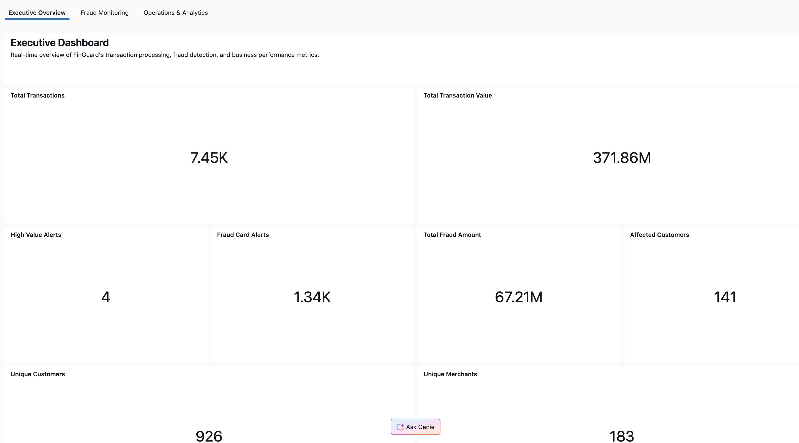
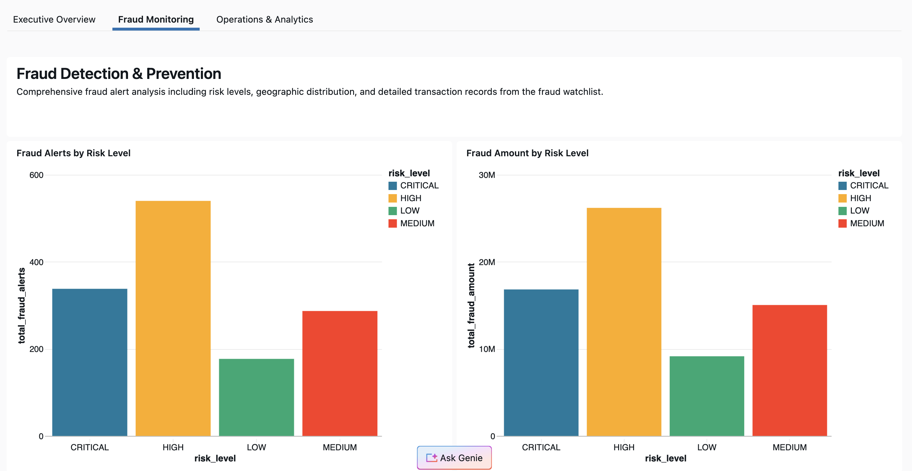
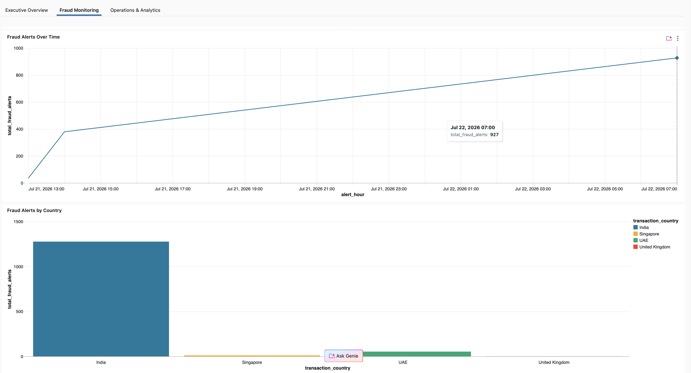
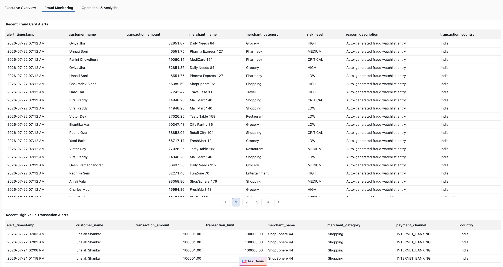
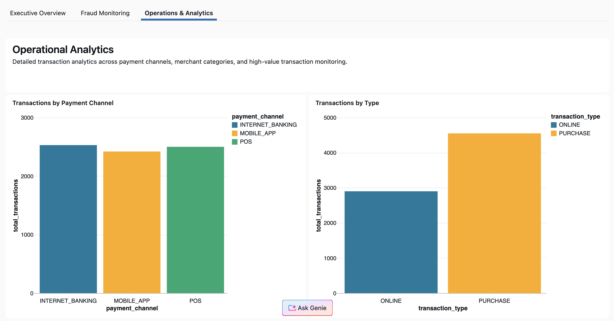
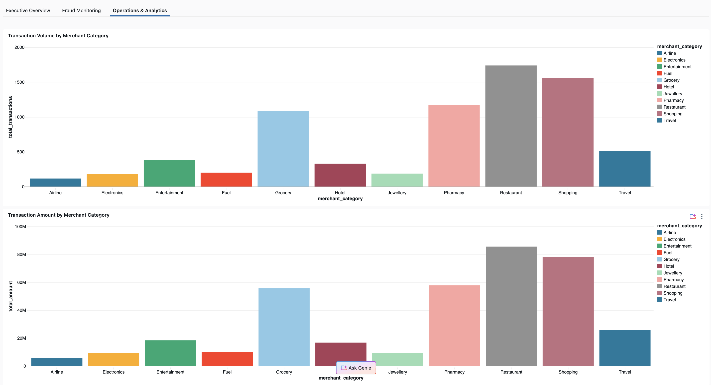

# Finguard - Real-time Fraud Detection and Transaction Montioring Platform

End-to-End Streaming data engineering project built on Databricks, simulating a real-time fraud detection and customer alerting system named Finguard for an imaginary bank.

## Table of Contents

1. Project Overview
2. Architecture Overview
3. Tech Stack
4. Data Sources
5. Layer-by-Layer Design
6. Repository Structure
7. Dashboard
8. Email Alerts
9. Orchestration
10. How to run the project

## 1. Project Overview

Banks need to detect fraudlent or high-risk transactions as they happen, not hours later in a nightly batch job.

Finguard simulates this by joining live transaction streams against a fraud watchlist and customer profile data and firing real-time alerts the moment a match or suspicious pattern is detected.

The project ingests customers, watchlist and transaction data from batch and streaming sources, process it through a Medallion (Bronze -> Silver -> Gold) architecture using Spark Declarative Pipelines (lakeflow) and delivers real time fraud alerts to customers via email alongside a live monitoring dashboard.

## 2. Architecture Overview


## 3. Tech Stack

| Component        | Technology                                               |
| ---------------- | -------------------------------------------------------- |
| Compute/Platform | Databricks Free edition                                  |
| Governance       | Unity Catalog                                            |
| Data Sources     | Apache Kafka, Streaming Files, Postgres SQL Database     |
| Data Ingestion   | Spark Streaming, Databricks Autoloader, Lakeflow Connect |
| Orchestration    | Lakeflow Jobs                                            |
| Transformation   | Spark Declarative Pipelines                              |
| Source Control   | Github via Databricks Repos                              |
| Consumption      | Gmail Alerts, Databricks Dashboards                      |

## 4. Data Sources

| Data                            | Type      | Source               |
| ------------------------------- | --------- | -------------------- |
| Customers Master Data           | Batch     | PostgresSQL          |
| Fraud Watchlist (Flagged Cards) | Streaming | Volumes (JSON Files) |
| Live Transactions               | Streaming | Kafka                |

## 5. Layer-by-Layer Design

## Bronze

- In bronze layer we ingest Customers Master data from Postgres SQL Database using Lakeflow Connect as a daily batch load
- We ingest Fraud Watchlist streaming data using Autoloader
- We ingest Live Transactions data from kafka using Spark Streaming

## Silver

- We perform data validation, cleaning and transformation using Spark Declarative Pipelines

## Gold

- In gold layer we join the data streams and send the real time high_value_transaction alert and fraud card alerts to customers in real time using Gmail SMTP Server
- Implemented business-level aggregations in the Gold layer for reporting and analytics.

## Dashboard

- Built a real-time monitoring dashboard using Silver and Gold layer tables.

## 6. Repository Structure

```
.
├── images
├── Notebooks
│   ├── 1.Setup
│   │   └── 02_Setup_Secret_Scope.py
│   ├── 2.fraud_watchlist_file_generator
│   │   ├── fraud_watchlist_data_generator.py
│   │   └── fraud_watchlist.csv
│   ├── 3.finguard_customers_silver_load
│   │   └── silver
│   │       └── customers_silver.py
│   ├── 4.finguard_streaming
│   │   ├── alert
│   │   │   ├── fraud_card_alert_email_notifier.py
│   │   │   └── high_value_transaction_email_notifier.py
│   │   ├── bronze
│   │   │   ├── fraud_watchlist_bronze.py
│   │   │   └── transactions_bronze.py
│   │   ├── gold
│   │   │   ├── fraud_card_alert.py
│   │   │   ├── high_value_transactions_alert.py
│   │   │   ├── transaction_count_by_minute_sliding_window.py
│   │   │   └── transaction_count_by_minute.py
│   │   └── silver
│   │       ├── fraud_watchlist_silver.py
│   │       └── transactions_silver.py
│   └── 5.Dashboard
│       └── FinGuard Real-Time Monitoring Dashboard.lvdash.json
├── README.md
└── source_files
    ├── kafka_producer
    └── postgres sql

```

## 7. Dashboard








## 8. Email Alerts


## 9. Orchestration

- We run customer_ingestion_source_to_silver daily batch job to fetch change customer data.
- We run finguard_streaming pipeline in continious mode.

## 10. How to run the project

- create the customers table in a postgres source database using .sql files in source_files
- create a kafka topic named credit_card_tansactions
- Use the kafak_producer folder in source_files in local machine and configure to write to the kafka topic
- Read transactions from the kafka topic using spark streaming
- run the finguard_streaming pipeline in continous mode and customer_ingestion_source_to_silver as a daily batch job

## Notes:

https://youtu.be/SsE5ZfxtiOI /

I have followed the above tutorial as reference for building this project.
