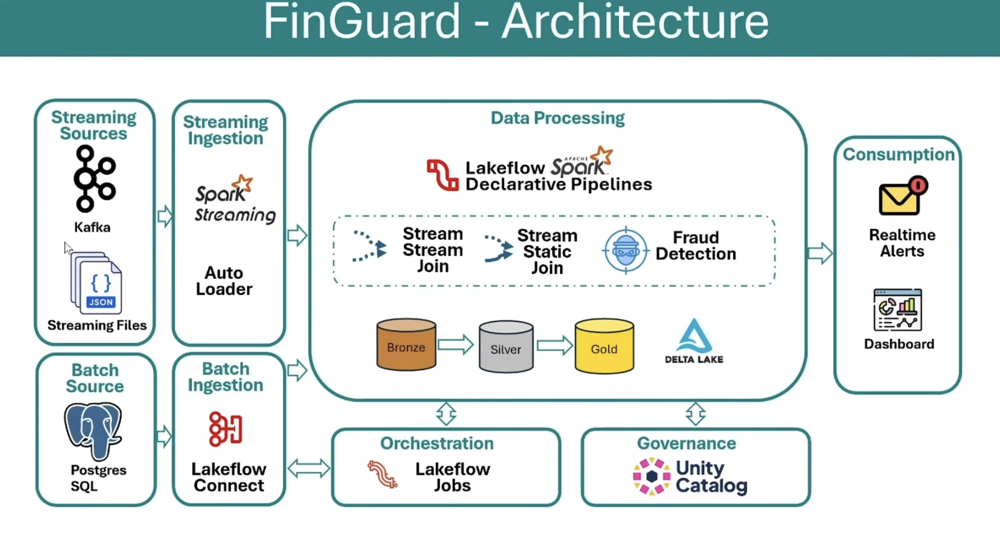

# Finguard - Real-time Fraud Detection and Transaction Montioring Platform

End-to-End Streaming data engineering project built on Databricks, simulating a real-time fraud detection and customer alerting system named Finguard for an imaginary bank.

## Table of Contents

1. Project Overview
2. Architecture Overview
3. Tech Stack
4. Data Sources
5. Layer-by-Layer Design
6. Key Engineering Decisions
7. Repository Structure
8. Dashboard
9. Orchestration
10. Know Issues and Roadmap
11. How to run the project

## 1. Project Overview

Banks need to detect fraudlent or high-risk transactions as they happen, not hours later in a nightly batch job.

Finguard simulates this by joining live transaction streams against a fraud watchlist and customer profile data and firing real-time alerts the moment a match or suspicious pattern is detected.

The project ingests customers, watchlist and transaction data from batch and streaming sources, process it through a Medallion (Bronze -> Silver -> Gold) architecture using Spark Declarative Pipelines (lakeflow) and delivers real time fraud alerts to customers via email alongside a live monitoring dashboard.

## 2. Architecture Overview

## 3. Tech Stack

| Component        | Technology                                               |
| ---------------- | -------------------------------------------------------- |
| Compute/Platform | Databricks Free edition                                  |
| Governance       | Unity Catalog                                            |
| Data Sources     | Apache Kafka, Streaming Files, Postgres SQL Database     |
| Data Ingestion   | Spark Streaming, Databricks Autoloader, Lakeflow Connect |
| Orchestration    | Lakeflow Jobs                                            |
| Transformation   | Spark Declarative Pipelines                              |
| Source Control   | Github via Databricks Repos                              |
| Consumption      | Gmail Alerts, Databricks Dashboards                      |

## 4. Data Sources

| Data                            | Type      | Source               |
| ------------------------------- | --------- | -------------------- |
| Customers Master Data           | Batch     | PostgresSQL          |
| Fraud Watchlist (Flagged Cards) | Streaming | Volumes (JSON Files) |
| Live Transactions               | Streaming | Kafka                |

## 5. Layer-by-Layer Design

## Bronze

- In bronze layer we ingest Customers Master data from Postgres SQL Database using Lakeflow Connect as a daily batch load
- We ingest Fraud Watchlist streaming data using Autoloader
- We ingest Live Transactions data from kafka using Spark Streaming

## Silver

- We perform data validation, cleaning and transformation using Spark Declarative Pipelines

## Gold

- In gold layer we join the data streams and send the real time high_value_transaction alert and fraud card alerts to customers in real time using Gmail SMTP Server
- Also perform business level aggregates in gold layer

## Dashboard

- Built a real-time monitoring dashboard based on silver and gold tables
